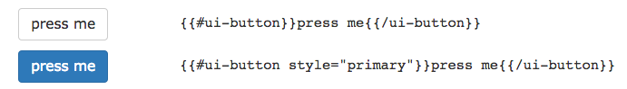

# ui-button  [](http://badge.fury.io/js/ui-button)
> Dancing, shiny buttons with Bootstrap styling.

## Install ##

````bash
ember install ui-button
````

## Usage ##



````hbs
  {{ui-button title='press me'}}
````

For more details on the syntax check out the interactive demo:

> [ui-button demo](http://current.development.ui-button.divshot.io)

## Dependencies ##

The only forced dependency that this introduces is a very small amount of CSS from the great Animate.CSS repo. We only include the *attention grabbers* transitions; the rest is available to be added manually if you choose (aka, adding manually in your Brocfile).

In addition though you should include the following:

- Autoprefixer

    Install the Ember CLI Autoprefixer ... this will ensure that the CSS animations are transformed to the appropriate browser syntax. It's also just a really good idea to have this installed anyway. Install it by:

    ````bash
    ember install:addon ember-cli-autoprefixer
    ````

- Twitter Bootstrap

    You'll want Twitter Bootstrap (SASS or otherwise) around to make everything look nice. You could style things yourself but this addon assumes a styling naming convention borrowed from Twitter. 


## Version Compatibility

This may very well work with older version of Ember and Ember-CLI but it was intended for:

- Ember 1.11.0+
- Ember-CLI 0.2.2+

## Repo Contribution

We're open to your creative suggestions but please move past the "idea" stage 
and send us a PR so we can incorporate your ideas without killing ourselves. :)

## Licensing

This component is free to use under the MIT license:

Copyright (c) 2015 LifeGadget Ltd

Permission is hereby granted, free of charge, to any person obtaining a copy of
this software and associated documentation files (the "Software"), to deal in
the Software without restriction, including without limitation the rights to
use, copy, modify, merge, publish, distribute, sublicense, and/or sell copies
of the Software, and to permit persons to whom the Software is furnished to do
so, subject to the following conditions:

The above copyright notice and this permission notice shall be included in all
copies or substantial portions of the Software.

THE SOFTWARE IS PROVIDED "AS IS", WITHOUT WARRANTY OF ANY KIND, EXPRESS OR
IMPLIED, INCLUDING BUT NOT LIMITED TO THE WARRANTIES OF MERCHANTABILITY,
FITNESS FOR A PARTICULAR PURPOSE AND NONINFRINGEMENT. IN NO EVENT SHALL THE
AUTHORS OR COPYRIGHT HOLDERS BE LIABLE FOR ANY CLAIM, DAMAGES OR OTHER
LIABILITY, WHETHER IN AN ACTION OF CONTRACT, TORT OR OTHERWISE, ARISING FROM,
OUT OF OR IN CONNECTION WITH THE SOFTWARE OR THE USE OR OTHER DEALINGS IN THE
SOFTWARE.

